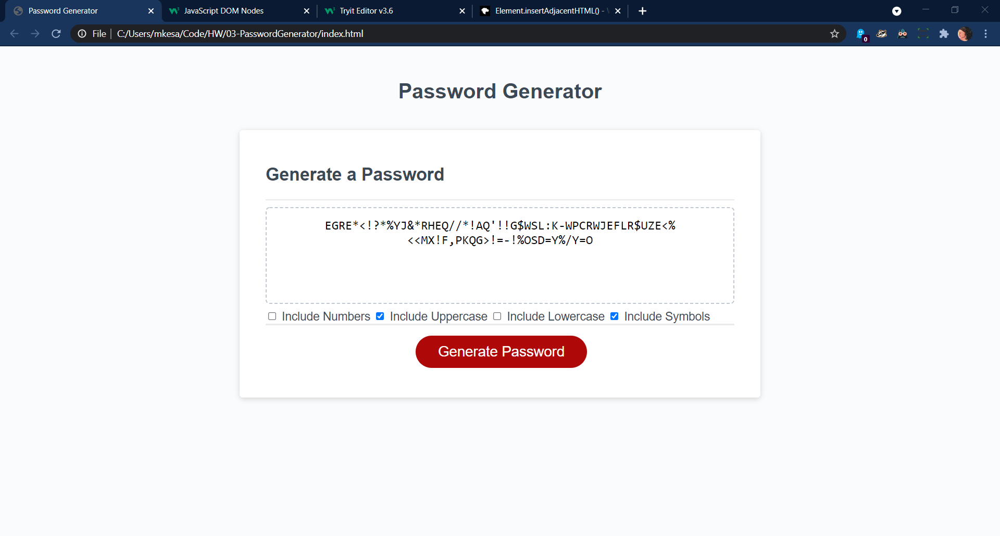

Password Generator

We were to create an application that generates passwords while satisfying provided criteria.

Very recently, we started to cover DOM manipulation via JS. I wanted to try and use some of the tools we spoke about in order to understand them better.

Created dynamic HTML content to insert checkboxes for certain options.
Used prompt/alert to set password parameters and determine password length.
Pushed array items based on user input into an empty array from which the password is to be generated.
Created a for loop to generate password based on user chosen password length.

Link: https://mehaletkb.github.io/03-PasswordGenerator/

